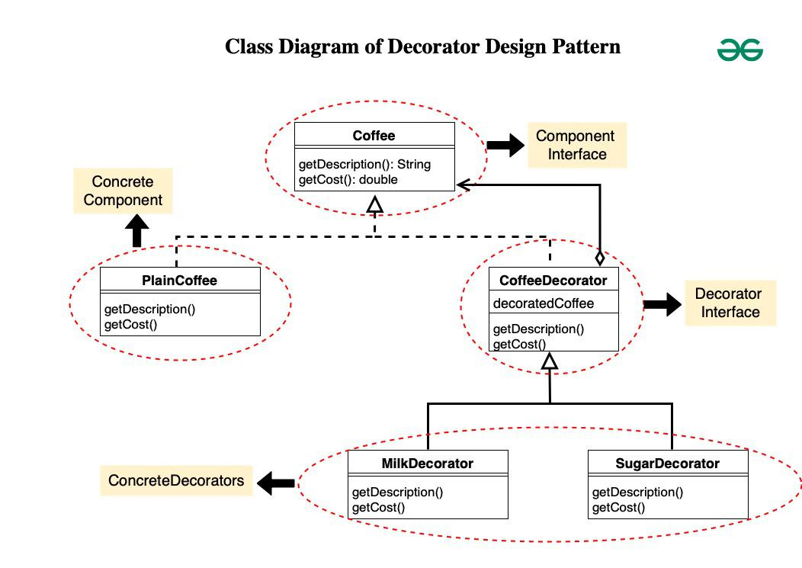

# 🎯 Java Design Patterns

This repository contains implementations of all major **Design Patterns** in **Java**.

---

## 📁 Folder Structure

Each folder under `org.designPatterns` represents a single design pattern/principle which contains the following folder
- `wrong`: this folder contains code snippet where the Principle was broken
- `right`: this folder contains code snippet where the Principle was Fixed

```aiignore
src
├── main/
│ ├── java/
│ │ ├── org/
│ │ │ ├── designPatterns/
│ │ │ │ ├── {pattern_name}
│ │ │ │ │ ├── right
│ │ │ │ │ ├── wrong

```

---

## Table of Content

<details>
  <summary style="margin-left: 20px;font-size:20px;">&nbsp;<a href="#solid-principle">Solid Principles</a></summary>
  <ul>
    <li style="display:block">
      <details>
        <summary style="margin-left: 20px;"><a href="#single-responsibility">Single Responsibility</a></summary>
      </details>
    </li>
    <li style="display:block">
      <details>
        <summary style="margin-left: 20px;"> <a href="#open-closed-principle">Open Closed Principle</a></summary>
      </details>
    </li>
    <li style="display:block">
      <details>
        <summary style="margin-left: 20px;"> <a href="#liskov-substitution">Liskov Substitution</a></summary>
      </details>
    </li>
    <li style="display:block">
      <details>
        <summary style="margin-left: 20px;"><a href="#interface-segregation">Interface Segregation</a></summary>
      </details>
    </li>
    <li style="display:block">
      <details>
        <summary style="margin-left: 20px;"><a href="#dependency-inversion">Dependency Inversion</a></summary>
      </details>
    </li>

  </ul>

</details>

[//]: # (strategy design pattern)
<details>
<summary style="margin-left: 20px;font-size:20px;">&nbsp;<a href="#strategy-design">Strategy Design Pattern</a></summary>
</details>

[//]: # (Observer design pattern)
<details>
<summary style="margin-left: 20px;font-size:20px;">&nbsp;<a href="#observer-Design-Pattern">Observer Design Pattern</a></summary>
</details>

[//]: # (Decorator design pattern)
<details>
<summary style="margin-left: 20px;font-size:20px;">&nbsp;<a href="#Decorator-Design-Pattern">Decorator Design Pattern</a></summary>
</details>


---
## S.O.L.I.D PRINCIPLE

- The SOLID principles are five essential guidelines that enhance software design, making code more maintainable and scalable.

### Single Responsibility

#### Desc

- Single purpose, can have many methods
- if one interface has one responsibility, it is called ISP - interface Segregation Principle

#### Adv 

- Better Maintenance
- better Readability
- Easy Testing
- Scalability
- Reusable

#### DisAdv

- More classes, more boilerplate

#### Example

- Right

```java
public interface Invoice {
    public List<String> items = List.of();

    public void addItem(String item);

    public void removeItem(String item);

    public double calculateTotal();
}
```

- Wrong

```java
public interface Invoice {
    public void calculateTotal();

    public void saveToDatabase(); // 🛑 unrelated responsibility

    public void printInvoice();   // 🛑 unrelated responsibility
}
```

### Open closed principle

#### Desc

- Open for extension, but closed for modification

#### Adv (#open-closed-adv)

- do not break existing code
- simplifies testing
- adding new feature is less risky
  
#### Disadv

- More boiler plate
    - overuse of inheritance, too many classes

#### Example

- Wrong

```java
public class PaymentProcessor {
    public void pay(String type) {
        if (type.equals("CreditCard")) {
            // Credit card logic
        } else if (type.equals("UPI")) {
            // UPI logic
        } else if (type.equals("PayPal")) {
            // PayPal logic
        }
    }
} 
```

- Right

```java
public interface PaymentMethod {
    void pay();
}

public class CreditCardPayment implements PaymentMethod {
    public void pay() {
        System.out.println("Paying with Credit Card");
    }
}

public class UpiPayment implements PaymentMethod {
    public void pay() {
        System.out.println("Paying with UPI");
    }
}

public class PaymentProcessor {
    public void processPayment(PaymentMethod method) {
        method.pay();
    }
}
```

### Liskov Substitution

#### Desc

- A child class should be replaceable by parent

#### Adv

- prevent runtime error
- Easily testable
- Strong contract

#### Disadv

- More boiler plate
- Run time instaceof Checking might be required to handle edge case
    - all payment have refund except cash

#### Example

- Wrong

```java
// 🛑 all birds cannot fly
public abstract class Bird {
    public abstract void makeSound();

    public abstract void fly();
}

public class Ostrich extends Bird {
    @Override
    public void fly() {
        throw new UnsupportedOperationException("Ostrich can't fly");
    }

    @Override
    public void makeSound() {
        System.out.println("Boom boom");
    }
}
```

- Right

```java
public abstract class Bird {
    public abstract void makeSound();
}

public abstract class FlyingBird extends Bird {
    public abstract void fly();
}

public class Sparrow extends FlyingBird {
    public void makeSound() {
        System.out.println("Chirp");
    }

    public void fly() {
        System.out.println("Flying...");
    }
}

public class Ostrich extends Bird {
    public void makeSound() {
        System.out.println("Boom boom");
    }
}

```

### Interface Segregation

#### Desc

- A client should not be forced to depend on interfaces it does not use.

#### Adv

- prevent runtime error
- Easily testable
- Strong contract

#### Disadv

- More boiler plate
- Run time instaceof Checking might be required to handle edge case
    - all payment have refund except cash

#### Example

- Wrong

```java
public interface Machine {
    void print();

    void scan();

    void fax();
}

// 🛑 Basic printer can't scan and fax
public class BasicPrinter implements Machine {
    public void print() {
        System.out.println("Printing...");
    }

    public void scan() {
        throw new UnsupportedOperationException("Scan not supported");
    }

    public void fax() {
        throw new UnsupportedOperationException("Fax not supported");
    }
}

```

- Right

```java
public interface Printer {
    void print();
}

public interface Scanner {
    void scan();
}

public interface Fax {
    void fax();
}

public class BasicPrinter implements Printer {
    public void print() {
        System.out.println("Printing...");
    }
}

public class AllInOnePrinter implements Printer, Scanner, Fax {
    public void print() {
        System.out.println("Printing...");
    }

    public void scan() {
        System.out.println("Scanning...");
    }

    public void fax() {
        System.out.println("Faxing...");
    }
}

```

### Dependency Inversion

#### Desc

- High level modules should not be dependent on low level concrete modules. both should be dependent on abstractions
- Don't hardcode dependencies — depend on interfaces, not concrete classes.

#### Adv

- flexible architecture
- Easy testing
- reduced coupling

#### disadv

- when abstraction is never change, then it's an overkill
- More boiler plate

#### Wrong

```java
public class EmailService {
    public void sendEmail(String message) {
        System.out.println("Sending email: " + message);
    }
}

/**
 *  🛑 `NotificationManager` is tightly coupled to `EmailService`.
 *  You can’t easily switch to SMSService, PushNotification, etc.
 */
public class NotificationManager {
    private EmailService emailService = new EmailService();  // tightly coupled

    public void notifyUser(String message) {
        emailService.sendEmail(message);
    }
}
```

#### Right

- interface

```java
public interface NotificationService {
    void send(String message);
}
```

- multiple services

```java
public class EmailService implements NotificationService {
    public void send(String message) {
        System.out.println("Sending email: " + message);
    }
}

public class SMSService implements NotificationService {
    public void send(String message) {
        System.out.println("Sending SMS: " + message);
    }
}
```

- Manager Service

```java

public class NotificationManager {
    private NotificationService service;

    public NotificationManager(NotificationService service) {
        this.service = service;
    }

    public void notifyUser(String message) {
        service.send(message);
    }
}

```

### Strategy Design

#### Desc
- In Startegy Design pattern we create an interface and it's different implementation based on strategy !! And inject appropriate startegy in client class by creating constructor or any injection of your choice
- Eg `@Component` in Springboot

#### Adv
- similar to open/closed
- Easy to test

#### Disadv
- kill for a child class strategy is never goona change
- Easy to test

#### Difference between Open/closed and Strategy

| Aspect          | Strategy                            | Open/closed                                     |
|-----------------|-------------------------------------|-------------------------------------------------|
| what is it      | Design                              | Principle                                       |
| goal            | Flexible behaviour; runtime changes | Achieve extensibility without code modification |
| when to apply?  | runtime algo selection              | add new features without changing old code      |

#### Example

- Wrong

```java
/**
 * 🛑 The PaymentProcessor is deciding which algorithm to use, and also contains the logic — it violates the Separation of Concerns.
 */
public class PaymentProcessor {
    public void pay(String type) {
        if (type.equals("CreditCard")) {
            // Credit card logic
        } else if (type.equals("UPI")) {
            // UPI logic
        } else if (type.equals("PayPal")) {
            // PayPal logic
        }
    }
} 
```

- Right

```java
/**
 * Strategy Pattern delegates the algorithm to a separate interchangeable class.
 */
public interface PaymentMethod {
    void pay();
}

public class CreditCardPayment implements PaymentMethod {
    public void pay() {
        System.out.println("Paying with Credit Card");
    }
}

public class UpiPayment implements PaymentMethod {
    public void pay() {
        System.out.println("Paying with UPI");
    }
}


public class PaymentStrategy {
    public void processPayment(PaymentMethod method) {
        method.pay();
    }
}
```

### Observer Design Pattern

#### Desc
- Observer Pattern defines a one-to-many dependency between objects so that when one object (the subject) changes state, all its observers are notified and updated automatically
- Eg Logging system is subscribed by File, Console.

#### Components

##### Observer
- Defines an `update()` method that is called when the subject changes

```java
public interface Observer<T> {
    void update(T data);
}
```

- Concrete Observer
```java
public class NewsSubscriber implements Observer<News> {
  private String name;

  public NewsSubscriber(String name) {
    this.name = name;
  }

  public void update(News news) {
    System.out.println(name + " received news: " + news);
  }
}
 
```
```java
public class News {
    private String title;
    private String author;
    
    public News(String title, String author) {
        this.title = title;
        this.author = author;
    }

    public String toString() {
        return title + " by " + author;
    }
}

```


##### Subject (Observable)
- Maintains a `list` of `observers`
- Provides methods to `add/remove` observers
- `Notifies` observers of `state changes`

```java
public interface Subject<T> {
    void subscribe(Observer<T> o);
    void unsubscribe(Observer<T> o);
    void notifyObservers(T data);
    void setData(T data);
}
```

- Concrete Subject
```java
public class NewsPublisher implements Subject<News> {
  private List<Observer<News>> observers = new ArrayList<>();

  public void subscribe(Observer<News> o) {
    observers.add(o);
  }

  public void unsubscribe(Observer<News> o) {
    observers.remove(o);
  }

  public void notifyObservers(News data) {
    for (Observer<News> o : observers) {
      o.update(data);
    }
  }

  public void setData(News news) {
    System.out.println("Publishing: " + news);
    notifyObservers(news);
  }
}
 
```

#### Adv

- Loose Coupling
- Flexibility with Generics
- Open/Closed Principle
- Supports real-time updates

#### Disadv
- Observer management can be tricky
- Risk of memory leaks
- Can introduce performance issues


#### Decorator Design Pattern

##### Desc
- The Decorator Design Pattern allows you to `dynamically` add `new behavior` or responsibilities to an object without `modifying` its `existing code`. 
- It's a `structural` pattern and follows the Open/Closed Principle.


##### Adv
- Open/Closed : Can add WhippedCreamDecorator or VanillaDecorator to coffee without modifying.
- Flexible Combinations : `Coffee coffee = new MilkDecorator(new SugarDecorator(new SimpleCoffee()));`
- Single Responsibility : Each decorator has only one job: add sugar, add milk, etc
- Runtime Behavior : 
```java 
if (userWantsMilk) {
  coffee = new MilkDecorator(coffee);
}
```

##### Disadv
- Order-Sensitive : If decorators are applied in the wrong order, behavior might change.
- Too Many Small Classes
- Harder to Debug

##### Class Diagram


##### Components

- Component interface
```java
// Coffee.java
public interface Coffee {
  String getDescription();
  double getCost();
} 
```

- ConcreteComponent/Base class (Plain coffee)
```java
// PlainCoffee.java
public class PlainCoffee implements Coffee {
  @Override
  public String getDescription() {
    return "Plain Coffee";
  }

  @Override
  public double getCost() {
    return 2.0;
  }
} 
```

- Decorator (Abstract) : it has a reference for decorated `Coffee` object. implement decorator class method to delegate to base class.
```java
// CoffeeDecorator.java
public abstract class CoffeeDecorator implements Coffee {
  protected Coffee decoratedCoffee;

  public CoffeeDecorator(Coffee decoratedCoffee) {
    this.decoratedCoffee = decoratedCoffee;
  }

  @Override
  public String getDescription() {
    return decoratedCoffee.getDescription();
  }

  @Override
  public double getCost() {
    return decoratedCoffee.getCost();
  }
} 
```

- Concrete Decorator: 
```java
// MilkDecorator.java
public class MilkDecorator extends CoffeeDecorator {
    public MilkDecorator(Coffee decoratedCoffee) {
        super(decoratedCoffee);
    }

    @Override
    public String getDescription() {
        return decoratedCoffee.getDescription() + ", Milk";
    }

    @Override
    public double getCost() {
        return decoratedCoffee.getCost() + 0.5;
    }
}

// SugarDecorator.java
public class SugarDecorator extends CoffeeDecorator {
    public SugarDecorator(Coffee decoratedCoffee) {
        super(decoratedCoffee);
    }

    @Override
    public String getDescription() {
        return decoratedCoffee.getDescription() + ", Sugar";
    }

    @Override
    public double getCost() {
        return decoratedCoffee.getCost() + 0.2;
    }
}
```

- Client
```java
public class CoffeeMachine {
    public static void main(String[] args) {
        Coffee coffee = new BasicCoffee();
        coffee = new MilkDecorator(new SugarDecorator(coffee));

        System.out.println(coffee.getDescription()); // Basic Coffee, Milk, Sugar
        System.out.println(coffee.getCost());
    }
}
```


